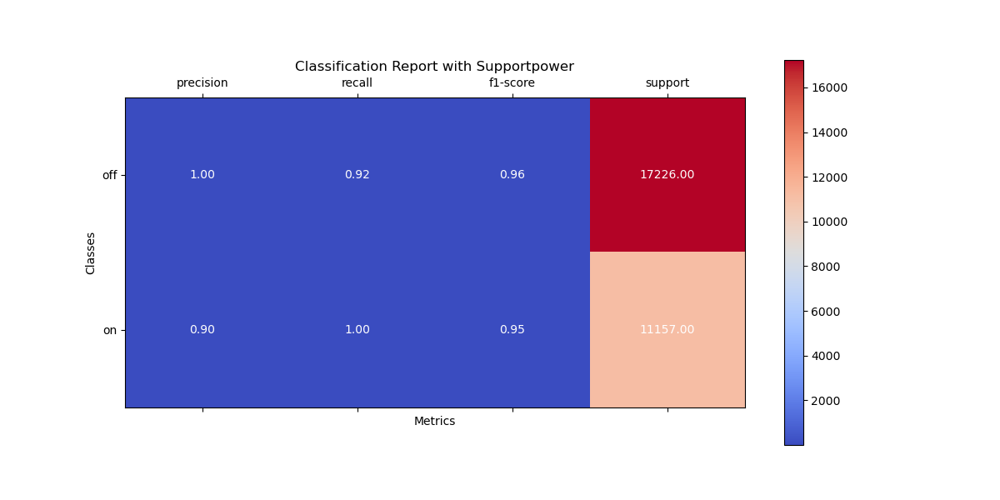
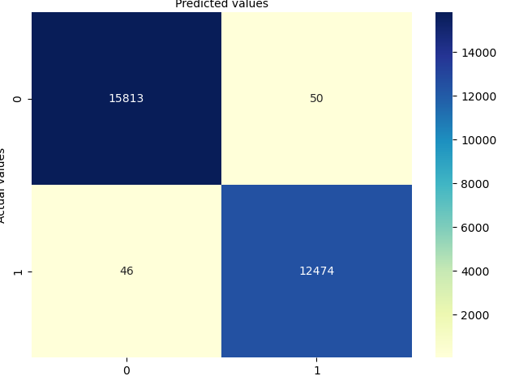

# Discussion Points for Data Science task

## Task 1 
Open data frame, convert unix ms column to date time and plot results.

* **Read Data:** Use read_excel

* **Data Cleaning:** Dropped unused columns and duplicates. There are quite a lot of duplicates but they don't seem to get dropped...

* **Converting Time:** Converting unix ms time to date time, and renaming column

* **Serial numbers:** Separate data frame by the 2 serial number (there are only 2 values, 227 and 30).

* **Plotting results:**
Instruction was to plot columns as a function of time. The dataset for each serial number is over 100 thousand data points. Plotting all on one graph is too cumbersome and isn't useful for visualisation. I have therefore opted for taking a slice of the data frame (only about 1000 data points and plotting the results for that.)

## Task 2: Regression models

The instructions are to create two different regression models to predict the values for the power, voltage and current based on values for delta_t_ms, on-off and cg_temperature. And evaluate the models.

**Data exploration**
It seems like the each of the data is in spikes. There seems to be quite a good correlation between on-off and the high-low values for each of the power, voltage, and current values that we have to predict.

**Data pre-processing**
I decided to represent the data to predict as binary data: off or on (0 or 1) depending on if the value is high or low. 

I created a `to_on_off` lambda function to transform each of the target columns (power, voltage, current) into binary. I got the mean for each of those columns, and assigned 0 if value was below mean, and 1 if value was above mean. Mean may not be the best value to use as a compartivie in this case, but in the interest of time, it seems suitable for the puproses of demonstration.

I then decided to predict if the value would be on, or off. 

I tried linear regression, and logistic regression (suitable for predicting binary classes)

*Note: I have trained the following model based on the binary data, and presented the results based on that. I have not re-converted binary values into actual voltage, current and power values.*

*How I would do that: For each power/current/voltage, take all values rows where the on-off values is 1. Get the median value using the active_power_mw, output_voltage_v, output_current_ma columns, and assign the "actual prediction" for high to be that. Similarly, get median values for what "low" should be.*

**Training and Testing dataset**

I used the sklearn `train_test_split` helper to separate the dataset into 70% training and 30% testing data.

I also made two training passes for each model: 
* One using all the input variables: `delta_t_ms`, `on-off` and `cg_temperature_cel`.
* The second one using only values for `on-off` 

I could also have created models for each of combinations (e.g. `on-off` and `cg_temperature_cel`, `delta_t_ms` and `on-off` etc) but in the interest of time and for demo-ing purposes, I stuck with two results, for each model.

### Linear Regression Model

**Model used**: Sklearn `LinearRegression` model, building a separate model for power, voltage and current that we are trying to predict.

In a linear regression model, there are several metrics that can be used to determine how well a model has performed. These are based on the deviation between predictions testing values.

Some examples of metrics that can be used:
* R-square or Coefficient Determination: represents proportion of variance for a dependant variable, explained by independant variable. 
* Mean Squarred Error (MSE): measure of average of square of the errors
* Mean Absolute Error (MAE): measured error between paired observations - arithmetic average of absolute errors.
* Standard Deviation: amount of variation or dispersion of the values.

And a few more statistical techniques based on the error detection between predicted and actual.

I've selected R2, MAE, and MSE for evaluating linear model. Choice of one of those would be enough to get an initial idea of how well the model is performing.

**Results for training data containing `delta_t_ms`, `on-off` and `cg_temperature_cel`**

|       |   Power   | Voltage | Current |
|-------| :-------: | ----    | --- |
|MAE |0.08498  | 0.00718 | 0.00783 |
|MSE |0.04143  | 0.00401 | 0.00349 |
|R2  |0.82635  | 0.98374 | 0.98583 |

**Results for training data containing only `on-off`**

|       |   Power   | Voltage | Current |
|-------| :-------: | ----    | --- |
|MAE |0.08264  | 0.00680 | 0.00822 |
|MSE |0.04079  | 0.00337 | 0.00403 |
|R2  |0.82899  | 0.98632 | 0.98360 |

For power and voltage it seems that just using on-off has slightly better predictions. However, that doesn't seem to be the case for current, where the preidctions were slightly bettre using all three input variables.

Linear regression is the most straighforward regression model and I therefore wanted to try it out on this dataset. Considering the dataset is represented by binary on/off values though, I didn't expect it to work so well.

### Logisitcal Regression Model Results

**Model used**: Sklearn `LogisticRegression` model, building a separate model for power, voltage and current that we are trying to predict.

Logistic regression is used for classification and should therefore be relatively well suited to this task.

There are a number of metrics that can be used to calculate the accuracy of a model using logistic regression.
* Confusion matrix: a tabular summary of True/False and Positive/Negative prediciton rates.
* Accuracy score: number of correct predictions / number of predictions.
* Precision: Number of true positives / total number of postivie predictions. Useful when the classes are very imbalanced.
* Recall / Sensitivity: Number of true positives / (nuber of trie positives + number of false negatives). The higher this score, the better the model is at identifying positives.
* Specificity: model ability to correctly predict negatives.
* F1 score: Combine precision and recall and its harmonic mean. Useful for data imbalance.
* Receiver Operating Characteristic (ROC) curve: used to obtain optimal probablity threshold to improve predictive capability of a machine learning model.

I have used sklearn's confusion metric and classification report, which contain details of accuracy, precision, recall and f1 score. I have also included MSE (same as MAE in this case) for comparison with previous model.

**Results for training data containing `delta_t_ms`, `on-off` and `cg_temperature_cel`**

*Power*
|MSE    | Accuracy |
|-------| :-------:| 
|0.04636| 0.95     | 

*Voltage*
|MSE    | Accuracy |
|-------| :-------:| 
|0.00405| 0.9959     | 

*Current*
|MSE    | Accuracy |
|-------| :-------:| 
|0.00590| 0.996  | 

**Results for training data containing only `on-off`**

*Power*
|MSE    | Accuracy |
|-------| :-------:| 
|0.04552| 0.95   | 

*Voltage*
|MSE    | Accuracy |
|-------| :-------:| 
|0.00338| 0.9967     | 

*Current*
|MSE    | Accuracy |
|-------| :-------:| 
|0.00405| 0.996    | 

## Task 3: Time Forecasting

Instructions:
*Make a model that predicts the future values of `active_power_w` based on the past values of `active_power_w`.*

My understanding is to use the `date` and `active_power_w` to feed into a time forecasting model.

**Tools for time forecasting**

* Sktime
Library allowing to do time forecasting. Reference: https://www.sktime.net/en/latest/api_reference/forecasting.html. 
Different forecasters available, e.g. `NaiveForecaster`, `TrendForecaster`. 

* Kats seems to have some good models avaialble - see https://github.com/facebookresearch/Kats/blob/main/tutorials/kats_201_forecasting.ipynb

* Orbit - tool for Bayesian time-series forecasting - https://github.com/uber/orbit

**Evaluation**

Many of the same metrics can be used with regards to regression problems - comparing predicted values with actual values and getting the error (e.g. MSE, MAE).
