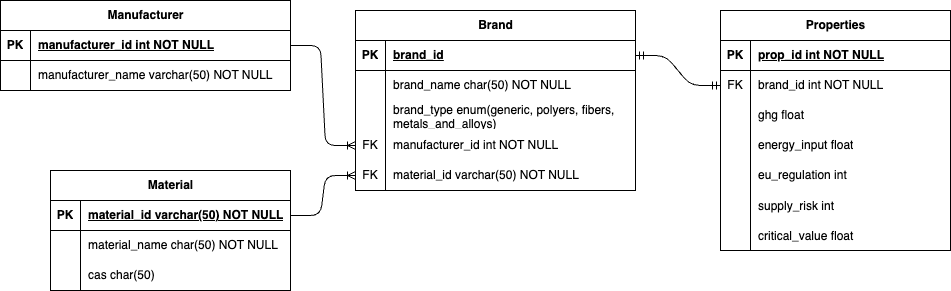

# Databse Design
This Readme serves as a write-up for discussion around the database design task.

## Task 1: Database Design
*Define relational database schema for the materials dataset.*

Observations on the dataset and relationsips:
* Brands are categorised using brand types
* Manufacturers can make serveral brands: Manufacturer have a one-to-many relationship with Brands.
* Materials can have several brands: Materials have a one-to-many relationship with Brands
* Manufacturers can make several Materials, and a Material can be made by several Manufacturers: there is a many-to-many relathionship between Manufacturers and Materials.
* Each Material has a unique formula, name, and CAS - so these should be grouped together to avoid repetition.
* There are different Properties for each Brand: one-to-one relationship between Brands and Properties.

Using those observations, I designed the following schema for the dataset:



*Notes: I have designed Property Keys and their data types with the little knowledge I had on the data. More details on expected values for these keys could help with designining stricter data types. For example, EU Regulation could potentually be only 1 of a few values? Stricter values, e.g. a `set` would help with data validation.*

## Task 2: Data Import

*Write a script or code to import the data from excel file into the database.*

I have created a small TypeScript project in the `database/` folder to open and parse the excel file, connect to a postgres database, and insert the values in the database.

**Files:**
* `index.ts`- entry point. Links excel parser, query builder, and database.
* `excelParser.ts` - parses in turn Manufacturers, Materials, Brands and Properties, and stores values in json object.
* `queryBuilder.ts` - uses the Manufactuerer, Materials, Brands and Properties object to build sql queries as strings for data insertion.
* `database.ts` - Database class using the `pg` npm package to connect to the postgres database, and call query API on the database client. Within `index.ts`, the built queries are sent to the database using the `query` endpoint.

*Note: I have used TypeScript for this task, as I am more familiar with the language and array manipluation than python. However if the database was much bigger, I would have created a python script using pandas to parse the excel file using dataframe*

## Task 4: Server
*Create a server with API endpoints return material properties in json format. Based on brand, manufacturer, or material*

In the `server/` folder, I have created an express server. There are two files: 
* `server.ts` - the implementation of the express server and handling of endpoints.
* `database.ts` - connection to the postgresql database using the npm `pg` package, and managing queries to the database.


### Express Endpoints
The main endpoint is: 
```
GET /data
```
This returns an array of all the data in the dataset in the following format: 
```json
[
     {
        "brand_id": 0,
        "brand_name": "Generic ABS",
        "brand_type": "generic",
        "manufacturer_name": "Generic",
        "material_id": "ABS",
        "material_name": "Acrylnitril-Butadien-Styrol-Copolymer",
        "cas": "9003-56-9",
        "ghg": 4.68,
        "energy_input": 100.16,
        "eu_regulation": 0,
        "supply_risk": null,
        "critical_value": 1
  },
  {
    ...
  }
]
```

The endpoint accepts a filter, passed through the query parameter, with which the results can be filtered according to brand name, manufacturer name, material name or material id.

```
GET /data?filter={filter_val}
```
The returned data will be in the same format. 

E.g. the following quuery: `GET /data?filter=Avient` returns the following data: 
```json
[
  {
    "brand_id": 30,
    "brand_name": "Edgetek PKE",
    "brand_type": "polyers",
    "manufacturer_name": "Avient",
    "material_id": "PK",
    "material_name": "Polyketone",
    "cas": "88995-51-1",
    "ghg": 3.16,
    "energy_input": 0.3,
    "eu_regulation": null,
    "supply_risk": 6,
    "critical_value": null
  },
  {
    "brand_id": 31,
    "brand_name": "LubriOne PKE",
    "brand_type": "polyers",
    "manufacturer_name": "Avient",
    "material_id": "PK",
    "material_name": "Polyketone",
    "cas": "88995-51-1",
    "ghg": 3.16,
    "energy_input": 0.3,
    "eu_regulation": null,
    "supply_risk": 6,
    "critical_value": null
  }
]
```

I have also added additional endpoints to retrieve name and ids of all items that can be used to filter with, namely brands, manufacturers and materials. These aren't used anywhere in the app, but can be used for future improvements client side - e.g. pre-fill list of suggestion for search bar. 


**Brands:** `GET /brands` returns an array of brand ids and names: 
```json
[
    {
        "id": 0,
        "name": "Generic ABS"
    },
    {
        "id": 1,
        "name": "Generic AEM"
    },
    ...
]
```

**Manufacturers:** `GET /manufacturers` returns an array of manufacturer ids and names: 
```json
[
    {
        "id": 0,
        "name": "Generic"
    },
    {
        "id": 1,
        "name": "Domo"
    },
    ...
]
```

**Materials:** `GET /materials` returns an array of manufacturer ids (formulas) and names: 
```json
[
    {
        "id": "ABS",
        "name": "Acrylnitril-Butadien-Styrol-Copolymer"
    },
    {
        "id": "AEM",
        "name": "Ethylene acrylic elastomers"
    },
    ...
]
```

### Database Query
To retrieve the data from the postregres database, the server makes use of the `pg` package and opens a `Pool` connection to the database.

One main sql query is built (as text) to retrieve all the data:
```sql
SELECT b.id AS brand_id
    , b.name AS brand_name
    , b.type AS brand_type
    , man.name AS manufacturer_name
    , mat.id AS material_id
    , mat.name AS material_name
    , mat.cas
    , p.ghg, p.energy_input, p.eu_regulation, p.supply_risk, p.critical_value
FROM Materials.brand b
INNER JOIN Materials.manufacturer man
    on b.manufacturer_id = man.id
INNER JOIN Materials.material mat
    on b.material_id = mat.id
INNER JOIN Materials.properties p
    on p.brand_id = b.id
```
This returns all data from the database, in array format.

To filter, an additional constraint is added to the query:
```sql
    WHERE b.name = $1::text 
    OR man.name = $1::text 
    OR mat.id = $1::text
    OR mat.name = $1::text
```
where `$1` is the filter variable passed on using query parameters.

This whole query therefore allows to filter by brand name, manufacturer name, material id and material name through one re-usable query.

I have also created a more generic query to retrieve the id and name for a table, given a table name: (to be used to retrieve brand, manufacturer and material id and names):

 ```sql
 SELECT id, name FROM Materials.{table_name}
 ```


